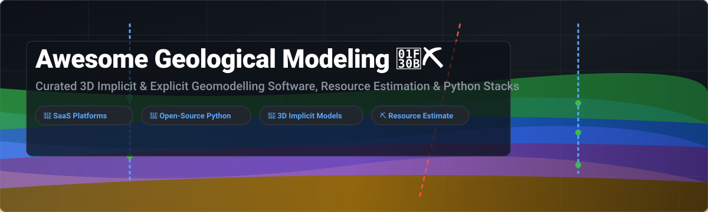

# 🌋 Awesome Geological Modeling ⛏️

  

     

## 📌 Top Geological Modeling Platforms & Open-Source Ecosystem 🗺️

**Curated List of SaaS Products & Open-Source GitHub Projects**

*Focused on 3D Implicit & Explicit Geological Modelling, Resource Estimation, Structural Geology, Geostatistics & Subsurface Interpretation*

**Last updated: September 2026** 📅

---

This repository tracks notable **SaaS/desktop platforms** 💎 and **open-source projects** 🐍 for **Geological Modeling** 🏔️. These systems build 3D geological models from drillholes, structural data, seismic interpretation, and geophysics for mining, exploration, petroleum, geothermal, and geotechnical applications.

**Examples** include Leapfrog Geo (Seequent), Petrel (SLB), Datamine Studio RM, Move (Petroleum Experts), Micromine Origin, GEOVIA, Maptek Vulcan, and RockWorks.

**Open-source emphasis**: Production mining and petroleum geological modelling is dominated by commercial software. The strongest open option is **GemPy** for implicit 3D structural modelling, alongside **PyVista** for 3D mesh rendering, **QGIS** for GIS mapping, and **SimPEG** for geophysical inversion.

Contributions welcome! Open a PR to add or update entries. Keep descriptions factual and link to official sites. 🤝

---

## 📑 Table of Contents

- [📊 Sector Market Overview](#-sector-market-overview)
- [💎 Commercial & SaaS Platforms](#-commercial--saas-platforms)
- [🐍 Open-Source GitHub Projects](#-open-source-github-projects)
- [🤝 How to Contribute](#-how-to-contribute)
- [☕ Support & Sponsorship](#-support--sponsorship)
- [📈 Star History](#-star-history)
- [⚠️ Disclaimer](#%EF%B8%8F-disclaimer)

---

## 📊 Sector Market Overview

> 💡 **Market Size & Structure**: The global Mine Planning & 3D Geological Modeling Software sector is estimated at **~$1.02 Billion USD in 2026** (projected to reach **$1.52B by 2032** at a 6.85% CAGR). The market is **moderately to highly concentrated**, dominated by key consolidated industrial conglomerates (Bentley Systems, SLB, Dassault Systèmes, Weir Group, Petroleum Experts) operating proprietary ecosystems alongside specialized desktop solutions.

---

## 💎 Commercial & SaaS Platforms

Commercial and cloud-hybrid solutions tailored for enterprise mining operations, petroleum reservoir engineering, and geotechnical projects. *(Sorted in descending order by parent company valuation / enterprise market capitalization)*

| Product Name | Description & Core Focus 🔍 | Parent / Company 🏢 | Valuation / Revenue 💰 | Starting Pricing Tier 🏷️ | Free Tier / Trial Limits ⏳ |
| :--- | :--- | :--- | :--- | :--- | :--- |
| **[Petrel (SLB)](https://www.software.slb.com/)** be | Subsurface interpretation & seismic-to-simulation reservoir modeling suite. | SLB (Schlumberger) | **~$65 Billion** (Market Cap) | ~$12,000 / seat / year (Core module) | **14-day evaluation** (requires corporate approval & contact form) |
| **[GEOVIA (Dassault Systèmes)](https://www.3ds.com/)** 🏢 | Mine planning, block modeling, & implicit geology suite (Surpac, GEMS, Minex). | Dassault Systèmes | **~$45 Billion** (Market Cap) | ~$5,000 / seat / year (Surpac base package) | **14-day demo access** (provided upon enterprise contact request) |
| **[Leapfrog Geo (Seequent)](https://www.seequent.com/)** 🌋 | Industry-leading 3D implicit geological modelling platform for rapid deposit interpretation. | Bentley Systems | **$1.05 Billion** (Acquired 2021; $106M Revenue) | ~$164.25 / day (Consultant Daily rate) | **14-day free trial** (plus free license during select online training courses) |
| **[Micromine Origin](https://www.micromine.com/)** ⛏️ | Integrated mineral exploration & 3D deposit modelling platform. | Weir Group | **~$840 Million** (£624M Acquisition in 2025) | ~$3,500 / seat / year (Base exploration module) | **14-day guided free trial** (requested via corporate portal) |
| **[Datamine Studio RM](https://www.dataminesoftware.com/)** 📊 | Resource estimation, block modelling, & structural interpretation software. | Constellation Software | **~$400 Million** (Division Est. Value) | ~$4,500 / seat / year (Studio RM module) | **14-day request-based trial** (requires company domain sign-up) |
| **[Move by Petroleum Experts](https://www.petex.com/)** 🌐 | Structural geology & tectonic kinematic restoration modelling toolkit. | Petroleum Experts (Petex) | **~$350 Million** (Estimated Value) | ~$8,000 / annual license (Commercial tier) | **No individual trial** (Free full 10-seat licenses available for accredited universities) |
| **[Maptek Vulcan](https://www.maptek.com/)** 🏗️ | 3D mine design, resource block modeling, & structural framework software. | Maptek (Private) | **~$150 Million** (Estimated Value) | ~$4,000 / seat / year (Vulcan Geology core) | **30-day evaluation trial** (upon application to regional office) |
| **[RockWorks](https://www.rockware.com/)** 🪨 | Borehole logging, cross-section creation, & 3D volumetric subsurface modelling. | RockWare (Private) | **~$20 Million** (Estimated Value) | $860 / year (Basic Tier) or $2,000 Perpetual | **14-day full feature trial** (reverts to restricted viewer mode post-trial) |

---

## 🐍 Open-Source GitHub Projects

Open-source Python toolkits, GIS plugins, visualization libraries, and geostatistical estimation engines for reproducible geomodelling workflows. *(Sorted in descending order by GitHub Stars_Count)*

| Repository & Link 📦 | GitHub_Stars 🌟 | Primary Category & Description 📝 |
| :--- | :--- | :--- |
| **[qgis/QGIS](https://github.com/qgis/QGIS)** 🗺️ |  | Open-source desktop GIS platform with powerful geological mapping, profile extraction, and 3D terrain plugins. |
| **[pyvista/pyvista](https://github.com/pyvista/pyvista)** 🎨 |  | 3D mesh rendering & VTK wrapper heavily used for visualizing implicit geological surfaces, block models, and drillhole traces. |
| **[subsurface/subsurface](https://github.com/subsurface/subsurface)** 🤿 |  | Subsurface dive log & digital depth profiling software ecosystem. |
| **[gempy-project/gempy](https://github.com/gempy-project/gempy)** 💎 |  | Leading open Python library for 3D implicit structural geological modelling with fault networks, folds, and probabilistic Bayesian uncertainty. |
| **[SimPEG/simpeg](https://github.com/SimPEG/simpeg)** 🧲 |  | Simulation and Parameter Estimation in Geophysics — open framework for geophysical inversion coupled with geological models. |
| **[gimli-org/gimli](https://github.com/gimli-org/gimli)** ⚡ |  | Multi-threaded library for geophysical modelling, electrical resistivity tomography (ERT), and inversion. |
| **[cgre-aachen/gemgis](https://github.com/cgre-aachen/gemgis)** 🌍 |  | Spatial data processing library connecting GIS layers (QGIS, GDAL, GeoPandas) to GemPy implicit model construction. |
| **[Loop3D/LoopStructural](https://github.com/Loop3D/LoopStructural)** 🔄 |  | Next-generation 3D structural geological modelling library supporting complex fold geometries and structural kinematics. |
| **[opengeostat/pygslib](https://github.com/opengeostat/pygslib)** 📐 |  | Python wrapper for GSLIB (Geostatistical Software Library) algorithms for mineral resource estimation & kriging. |
| **[equinor/xtgeo](https://github.com/equinor/xtgeo)** 🛢️ |  | Equinor's open-source Python library for manipulating subsurface 3D grids, surfaces, and well trajectories. |
| **[acroucher/PyTOUGH](https://github.com/acroucher/PyTOUGH)** ♨️ |  | Python scripting library for setting up and processing TOUGH2 geothermal & subsurface fluid flow simulations. |
| **[softwareunderground/subsurface](https://github.com/softwareunderground/subsurface)** 🧪 |  | Data structures for primary subsurface datasets (boreholes, seismic lines, 3D grids) by Software Underground. |

---

## 🤝 How to Contribute

1. Fork the repository 🍴
2. Create your feature branch (`git checkout -b feature/awesome-geomodel`) 🌿
3. Add or edit entries in `README.md` (ensure factual descriptions & direct links) ✍️
4. Submit a Pull Request with a clear description of changes 🚀

---

## ☕ Support & Sponsorship

If you find this curated geological modelling resource helpful, consider supporting the maintenance and continuous updates of this repository! 💖

- ⭐ **Star** this repository to increase visibility.
- 🔄 **Share** with colleagues and geoscience communities.
- ☕ **Sponsor / Buy me a coffee**: 

Thank you for helping keep geological modelling software accessible, transparent, and open! 🙏

---

## 📈 Star History

---

## ⚠️ Disclaimer

- This list is **community-curated** — not exhaustive and not an official corporate endorsement.
- 3D geological models underpin reserve estimates, mine safety, and major capital expenditure. Open-source packages require competent geoscience verification and domain expertise. This repository does not provide professional reporting (e.g. JORC, NI 43-101) advice.

---

  <b>Made with ❤️ for geologists, mining engineers, reservoir modellers, and geoscientists worldwide.</b>

